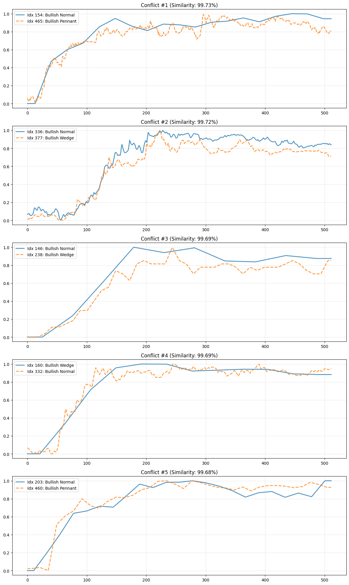

## Project Details

### Project Information

- **Selected Topic**: Bull-flag detector
- **Student Name**: Kristóf Moldován
- **Aiming for +1 Mark**: Yes

### Solution Description

The project addresses the problem of automating technical analysis by detecting specific chart patterns (Bull/Bear flags, Pennants, Wedges) in financial time-series data.

**Model Architecture:**
The solution utilizes 1D Convolutional Neural Networks (1D-CNNs), which are effective for extracting temporal features from sequential data.
- **Baseline Model:** A shallow 1D-CNN used to establish a performance benchmark.
- **Main Model (`FlagClassifier`):** A deeper 1D-CNN architecture designed to capture complex, hierarchical patterns in price movements.
- **Input:** Price sequences are normalized and interpolated to a fixed length of 512 time steps.

**Methodology:**
The pipeline includes robust data preprocessing (loading, cleaning, splitting) and a supervised training loop implemented in PyTorch. Key training features include:
- **Optimization:** Adam optimizer with CrossEntropyLoss.
- **Regularization:** Early Stopping and Learning Rate Scheduling (ReduceLROnPlateau) to ensure convergence and prevent overfitting.
- **Inference:** A sliding window approach is used to scan continuous time-series data for patterns, allowing for detection across various timeframes.

**Results:**
The model demonstrates strong performance in distinguishing between the primary market directions (Bullish vs. Bearish). While differentiating between specific sub-types (e.g., Pennant vs. Wedge) presents a greater challenge due to morphological similarities, the system effectively highlights potential pattern occurrences in unseen data using confidence-based density plots.


### Disclaimer
I used the help of the Gemini 3 on the project for faster coding.

### Extra Credit Justification


#### Main reason: 

Classification of continous timeseries, which are imported by a .CSV format. The results and plotted images are exported in the output folder.
(Documented in "05-Inference" notebook)

The timeseries of moving window can be custom sized, so any size of flags can be searched 🙂

Also added extra features supporting the whole process:
- Incremental model development (Compared 3 minimal models and built a bigger one)
  - Documented in 02-Model-building notebook
- Implemented optional cached Data Loading for fast training (set by default in config.py, uses ~700MB of RAM)
- Made a possible explaination of the low scores: Flags are too similar in different labels. (Documented in 04-Eval-Explaination.ipynb notebook) [See Similarity Examples](#similarity-examples)
- Automatic export of plot images into the output folder during the whole process
- Measured Bullish vs. Bearish capabilities (Examined in "04-Eval-Explaination" notebook)
  - I was assuming the model can differentiate well between "Bearish" and "Bullish" main groups, and the low scores are coming from classifying the subgroups. (Normal, Pennant, Wedge). I examined what if there was only 2 main groups.
  - Turned out this way the model performs better, the source of the original low scores is coming from "too similar" data in Normal, Pennant and Wedge groups, while the Bearish <-> Bullish feature is well recognized.

#### Similarity Examples <a name="similarity-examples"></a>

<details>
<summary>Click to expand similarity examples</summary>



</details>

### Docker Instructions

This project is containerized using Docker. Follow the instructions below to build and run the solution.

#### Build

Run the following command in the root directory of the repository to build the Docker image:

```bash
docker build -t dl-project .
```

#### Run

To run the solution, use the following command. You must mount the directory to `/app/data` inside the container.

Also mount the following volumes from the root of the repository:
- `data` -> `/app/data` - Data folder in the below described format
- `inference` -> `/app/inference`- The folder including a timeseries which will be classified on a moving window by the model. The path of - this .CSV must be set in the config.py file. (It is already set for the repository folder by default)
- `output` -> `/app/output` - The folder will contain these in the end of process: models, model training logs, plots, prediction of inference CSV file
- `src` -> `/app/src`
- `notebook` -> `/app/notebook`

#### Data Preparation

**Important!**

**The script handles** the data download, but for manual download, the data folder must be in this format:
- **`data/`**: Contains the source code for the machine learning pipeline.
    - `raw`: Folder containing the NEPTUN folders
      - `NEPTUN1`: Example NEPTUN folder containing a json and multiple csv files
        - `.json`: Obe json containing the labels
        - `.csv`: Multiple .CSV files containing the prices that were labeled in the json

A `processed` folder will be created next to the `raw` folder when data processing is done.

**To capture the logs for submission (required), redirect the output to a file:**

On Linux:

```bash
docker run --rm --gpus all \
  -v "${PWD}/data":/app/data \
  -v "${PWD}/inference":/app/inference \
  -v "${PWD}/output":/app/output \
  -v "${PWD}/src":/app/src \
  -v "${PWD}/notebook":/app/notebook \
  dl-project > log/run.log 2>&1
```

For PowerShell:

```
docker run --rm --gpus all `
   -v "${PWD}/data:/app/data" `
   -v "${PWD}/inference:/app/inference" `
   -v "${PWD}/output:/app/output" `
   -v "${PWD}/src:/app/src" `
   -v "${PWD}/notebook:/app/notebook" `
   dl-project *> .\log\run.log
```

*   PWD is the repository folder
*   All the listed volumes are used for mounting the folders in the repository.
*   The `> log/run.log 2>&1` part ensures that all output (standard output and errors) is saved to `log/run.log` on Linux. (On windows `*>` is used.)
*   The container is configured to run every step (data preprocessing, training, evaluation, inference).


### File Structure and Functions

The repository is structured as follows:

- **`src/`**: Contains the source code for the machine learning pipeline.
    - `00a-print-config.py`: Script to print configuration variables and model architectures for verification.
    - `00b-data-download.py`: Script to download and setup raw data from Google Drive.
    - `01-data-preprocessing.py`: Scripts for loading, cleaning, and preprocessing the raw data.
    - `02-training.py`: The main script for defining the model and executing the training loop.
    - `03-evaluation.py`: Scripts for evaluating the trained model on test data and generating metrics.
    - `04-inference.py`: Script for running the model on new, unseen data to generate predictions.
    - `config.py`: Configuration file containing hyperparameters (e.g., epochs) and paths.
    - `utils.py`: Helper functions and utilities used across different scripts.
    - **`lib/`**: Contains modularized components used by the main scripts.
        - `baseline_model.py`: Defines the baseline model architecture.
        - `dataloader.py`: Custom PyTorch Dataset implementation for loading flag data.
        - `model.py`: Defines the main FlagClassifier model architecture.
        - `seed_everything.py`: Utility for setting random seeds for reproducibility.
        - `training_loop.py`: Implements the training and validation loop with early stopping.

- **`notebook/`**: Contains Jupyter notebooks for analysis and experimentation.
    - `01-Data-Preprocessing.ipynb`: Notebook for initial exploratory data analysis (EDA) and preprocessing.
    - `02-Model-building.ipynb`: Notebook for incremental model testing and building
    - `03-Training.ipynb`: Notebook for training the Baseline and the Built model
    - `04-Eval-Explaination.ipynb`: Notebook for measuring model metrics and comparing 
    - `05-Inference.ipynb`: Notebook for making predictions on "timestamp, close" csv data, demonstrating custom window size and visualizing the results

- **`output/`**: Contains the output of a RUN ID set in config.py (plot images, model weights, histories and predictions)
    - `submission`: Contains of the output of the last run before the submission.
    - `latest`: Empty at submission. Will contain the output of next runs if config.py is not changed.

- **`log/`**: Contains logs of the runs
    - `submission.log`: The log of the last run before the submission.

- **Root Directory**:
    - `Dockerfile`: Configuration file for building the Docker image with the necessary environment and dependencies.
    - `requirements.txt`: List of Python dependencies required for the project.
    - `README.md`: Project documentation and instructions.
    - `run.sh`: Running the whole perparation-training-evaluation-inference pipeline
    - `similarity_examples.png`: An image showing the similar flags with different labels. Could be the reason of lower accuracy.
